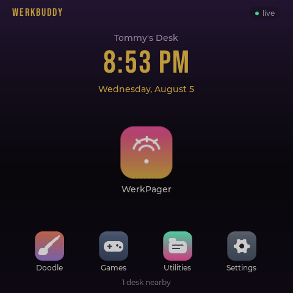
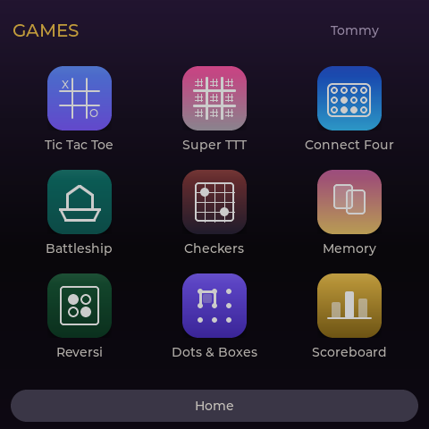
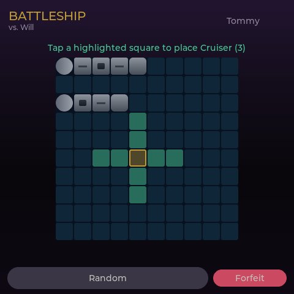
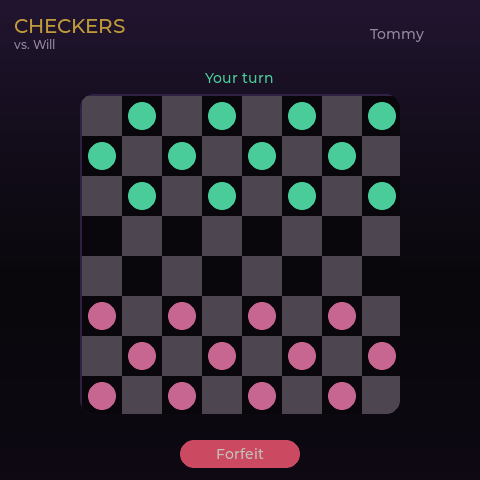
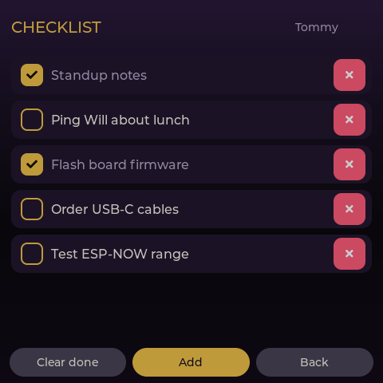

# WerkBuddy

A desk-to-desk **pager** with a bunch of mini-games, built for the **Guition ESP32-4848S040** (480×480 touchscreen). Desks talk to each other directly over **ESP-NOW** — no Wi-Fi and no server required for day-to-day use.

- **WerkPager** — send a quick ping (emoji + short message) to another desk and ring them.
- **Games** — Tic-Tac-Toe, Super TTT, Connect Four, Battleship, Checkers, Memory, Reversi, Dots & Boxes, and solo 2048.
- **Extras** — checklist, calculator, shared doodle canvas, timers, themes, and custom wallpaper.

## Screenshots

<p>






</p>

More screens — pager, games, utilities, and settings — are in [`docs/screenshots/`](docs/screenshots/).

## What you need

- A **Guition ESP32-4848S040** board (ESP32-S3, 16 MB flash, 480×480 touchscreen). This is the board it's built and tested for.
- One board per desk. With two or more desks you can page and play against each other.
- A USB-C **data** cable (a charge-only cable won't be detected).
- A PC for the first flash only (Windows shown below).

## Flashing a fresh board (first time)

The `.bin` on the [Releases](https://github.com/therzog92/WerkBuddy/releases) page is **only the app** — it does **not** include the bootloader or the partition table. That's fine for *updating* a board that already runs WerkBuddy (see "Updating" below), but a brand-new board needs the bootloader and partition table too.

The simplest way to put everything on in one step is **PlatformIO**:

1. Install **Python 3** and **PlatformIO Core** (`pip install platformio`).
2. Download or clone this repository.
3. Plug the board in with a **data** cable. It appears as a COM port (for example `COM5`). Check with `pio device list`.
4. Flash it:

   ```powershell
   cd firmware/device
   pio run -t upload --upload-port COMx
   ```

   (replace `COMx` with your actual port — `COM6`, `COM7`, etc.)

   This writes the **bootloader**, **partition table**, and **WerkBuddy app** together — which is why a fresh board uses this instead of the release `.bin`.

After it reboots it walks you through **Setup**: pick a desk name (that's how other desks see you). You'll land on the Home screen and you're ready.

> **Adding more desks:** flash each board the same way on its own COM port, then on each one go **Settings → Paging → Scan desks** and add the others.

## Updating over the air (board already on WerkBuddy)

Once a board is running WerkBuddy you don't need a cable to update:

1. **Settings → Network → Wi-Fi**: save a Wi-Fi network. (Wi-Fi is only used briefly for time sync and updates, then dropped.)
2. **Settings → Network → Updates**: pick a release and tap **Install**. It downloads, flashes, and reboots.

The release `.bin` (e.g. `werkbuddy-v0.70.bin`) is what OTA downloads — again, just the app, which is all that's needed when updating.

## Getting started (two desks)

1. Power both boards and give each a name in Setup.
2. On each desk: **Settings → Paging → Scan desks**, then add the other.
3. From Home:
   - **WerkPager** to ping a desk (and see page history).
   - **Games** to start a two-player match.

## Features

- **Home / idle** — app launcher, clock idle screen, themes, custom wallpaper.
- **WerkPager** — ping another desk, incoming/outgoing ring, page history, saved desks.
- **2-player games** (over ESP-NOW) — Tic-Tac-Toe, Super TTT, Connect Four, Battleship, Checkers, Memory, Reversi, Dots & Boxes.
- **Solo** — 2048, calculator, checklist, dual desk timers.
- **Shared doodle** — draw on the same canvas with another desk.
- **Settings** — name, theme, wallpaper, brightness, screen orientation, screen timeout, saved desks, canned messages & emojis, and over-the-air updates.

## Developing (optional)

The interface can run on a PC without hardware — handy for testing UI changes:

```powershell
powershell -File firmware/scripts/run-sim.ps1
```

(Requires MSYS2 MinGW + SDL2.) For building/flashing details and the device project layout, see [`firmware/device/README.md`](firmware/device/README.md).