# WerkBuddy

Desk **attention pager** + mini-games for nearby desks. Built for **480×480** capacitive glass talking over **ESP-NOW** (no Wi‑Fi required for core use).

| | |
|--|--|
| **Brand** | WerkBuddy (splash / chrome) |
| **Pager app** | WerkPager (Home tile) |
| **Hardware** | Guition **ESP32-4848S040** (ESP32-S3 N16R8, ST7701 + GT911) |
| **Shipping** | **[v0.67](https://github.com/therzog92/WerkBuddy/releases/tag/v0.67)** — full app on glass |
| **UX source of truth** | `firmware/` LVGL (PC SDL sim **and** device share the same `firmware/src`) |

---

## Screenshots

LVGL PC sim at device size (480×480).

<p>


</p>

<details>
<summary><strong>Shell</strong> — splash, setup, home, idle</summary>
<p>
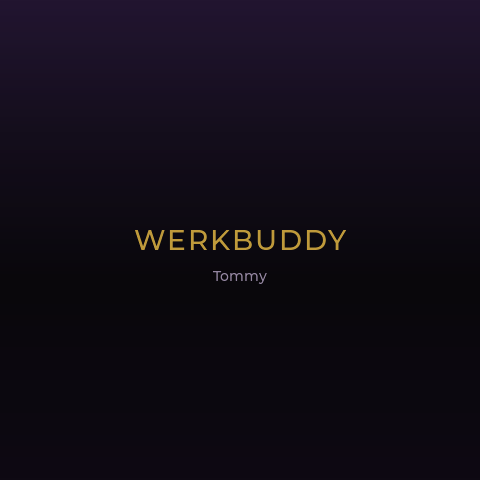
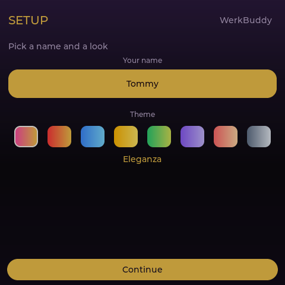

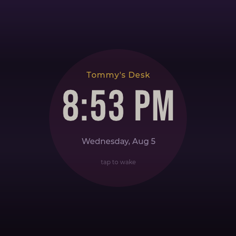
</p>
</details>

<details>
<summary><strong>WerkPager</strong> — peers, compose, outgoing, incoming, history</summary>
<p>
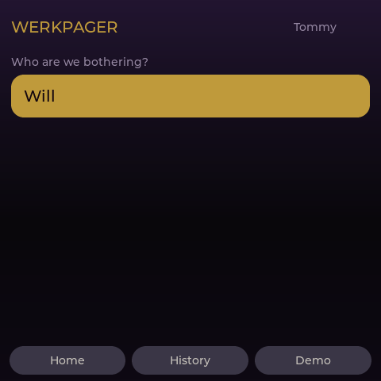
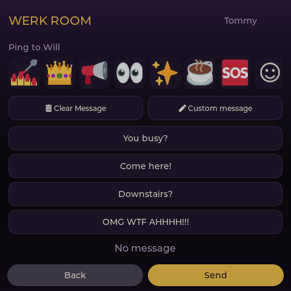
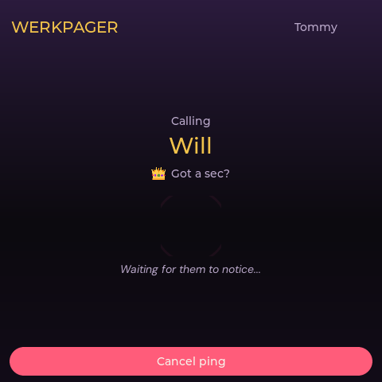

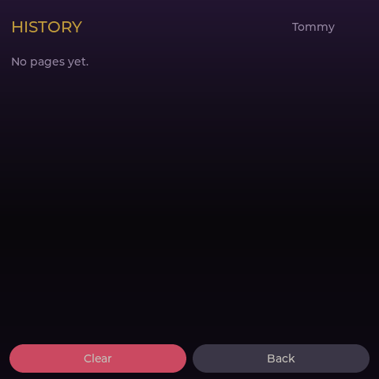
</p>
</details>

<details>
<summary><strong>Games</strong> — folder + boards</summary>
<p>

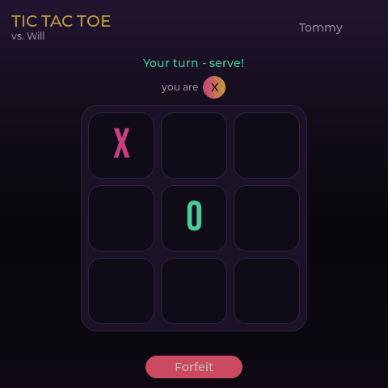
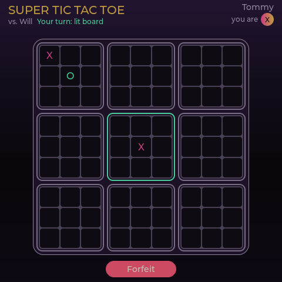
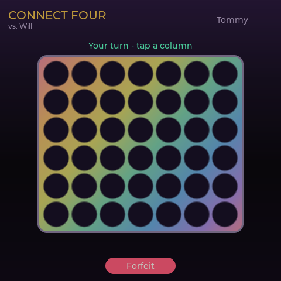


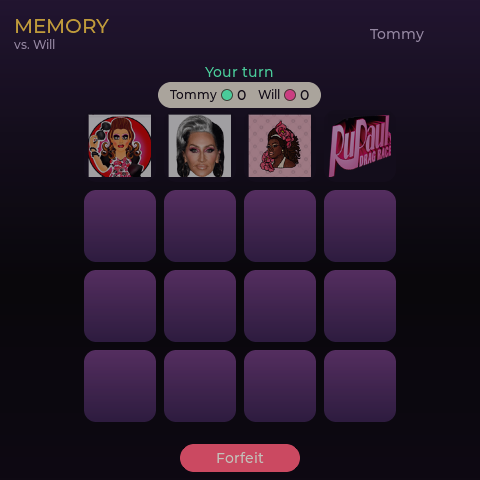
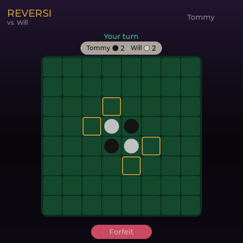
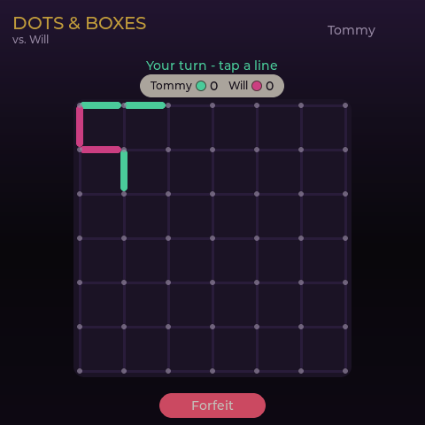
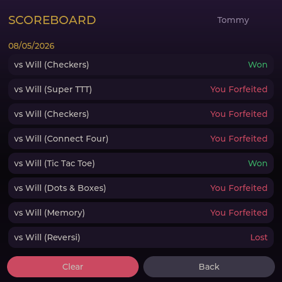
</p>
</details>

<details>
<summary><strong>Utilities & doodle</strong></summary>
<p>
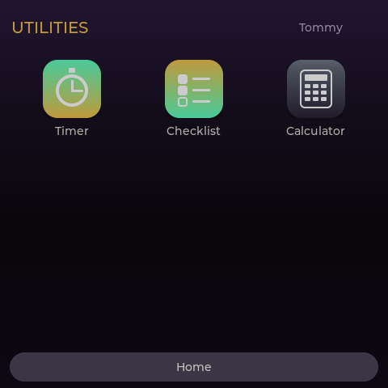
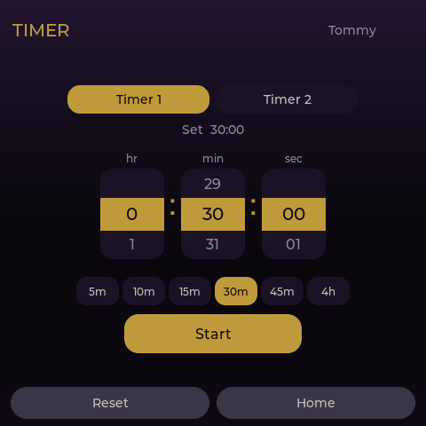

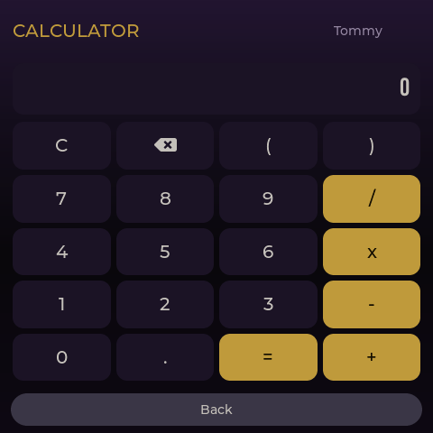
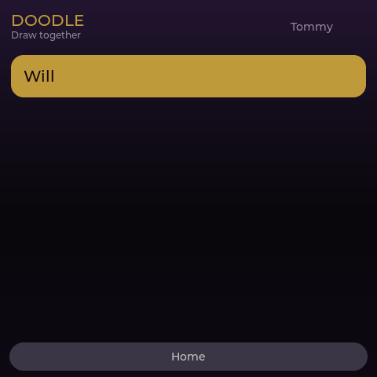
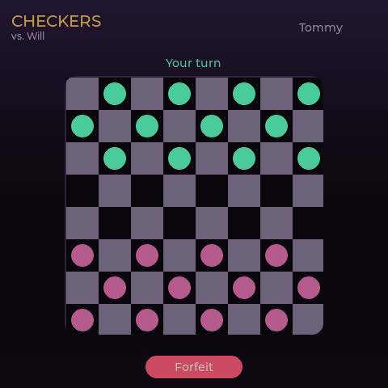
</p>
</details>

<details>
<summary><strong>Settings</strong> — keyboard, emoji, Wi‑Fi, OTA, background QR</summary>
<p>
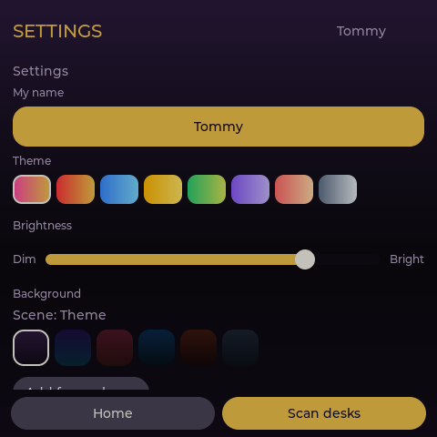
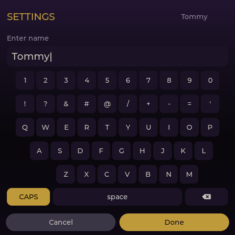
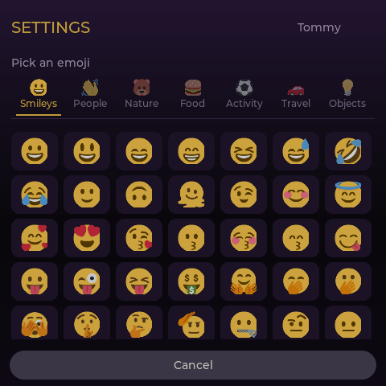
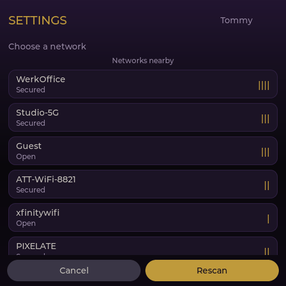
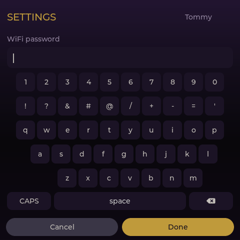
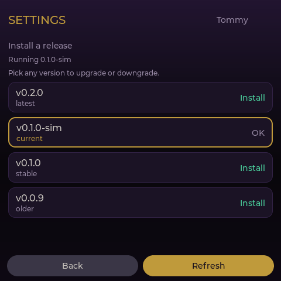
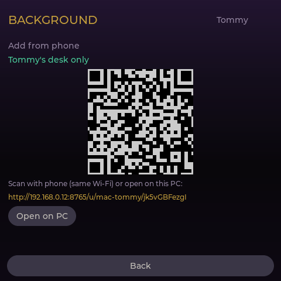
</p>
</details>

---

## Features

### Shell & power

| Feature | What you get | How it’s implemented |
|---------|--------------|----------------------|
| **Splash → Hub / Setup** | Boot chrome; first-run or post-reset wizard | `scr_splash.cpp` → `setup_done` gate |
| **Setup** | Name + theme before Home | `scr_setup.cpp`; name OSK via `build_keyboard(..., -7)` |
| **Home (Hub)** | WerkPager, Games, Utilities, Doodle, Settings; Active Games + Your Turn | `scr_hub.cpp` |
| **Idle** | **Black** (backlight off) or **Clock**; tap to wake | `scr_idle.cpp` + `nav.cpp` idle timer; `brightness::set_panel_on` drives `TFT_BL` |
| **Setup auto-blank** | After factory reset / first-run, **1 minute** idle → black + backlight off (safe in a bag) | `idle_tick` special-cases `!setup_done` |
| **Screen timeout** | 1m / 3m / 5m / 10m / Off | `desk.timeout_id` + `timeout_specs()` |
| **Brightness** | 10–100% (pages boost to full) | Soft dim overlay on sim; same API on device |
| **Flip 180** | UI + touch for stand orientation | `orient.cpp` + `desk.rotate_180` in NVS |
| **Factory reset** | Type `RESETME67` → wipe NVS data → Setup | `app::factory_reset()` |

### WerkPager

| Feature | What you get | How it’s implemented |
|---------|--------------|----------------------|
| **Peer pick / compose** | Emoji + canned (or custom) message | `scr_pager.cpp`; OSK for custom / Wi‑Fi / names |
| **Call ring** | Outgoing / incoming wash; Shantay / Sashay | FULL-frame wash via `display_perf` while ringing |
| **Page history** | Last **20** pages (newest first) | `page_log` → NVS/disk |
| **Saved desks** | Up to **8** peers | Discover → save in Settings; Hub uses saved list for paging |

### Games

| Feature | What you get | How it’s implemented |
|---------|--------------|----------------------|
| **Multiplayer suite** | Tic Tac Toe, Super TTT, Connect Four, Battleship, Checkers, Memory, Reversi, Dots & Boxes | Rules in `firmware/src/games/*`; UI in `scr_games.cpp` |
| **2048** | Solo + high score | `scr_g2048.cpp` |
| **Scoreboard** | Last **80** outcomes | `score_log` |
| **Active Games** | Up to **24** concurrent (one type per peer); invites + live; Forfeit + Home | `active_games.*` persisted to NVS |
| **Your Turn** | Hub strip + toasts when off-board | Focus / slot registry |
| **24h auto-forfeit** | Stale turn ends (monotonic uptime; pauses while off) | Active-games timer |
| **Memory faces** | RPDR-style pair art, seed-synced both desks | **Device:** baked RGB565 (`bake_memory_assets.py` → `memory_assets_gen.cpp`). **Sim:** `firmware/assets/memory/*.png` |

### Utilities & doodle

| Feature | What you get | How it’s implemented |
|---------|--------------|----------------------|
| **Timer** | Dual desk timers | `desk_timer` + `scr_timer.cpp` |
| **Checklist** | Local tasks | `checklist` + utils UI |
| **Calculator** | On-glass calc | `scr_utils.cpp` |
| **Doodle** | Shared canvas, colors, eraser, S/M/L | Chunked strokes over ESP-NOW (`kMaxStrokePts`) |

### Settings & connectivity

| Feature | What you get | How it’s implemented |
|---------|--------------|----------------------|
| **Themes / wallpaper** | Theme swatches; SoftAP QR upload → JPEG | Wallpaper baked to **RGB565 in PSRAM** once (`background_device.cpp`) |
| **On-screen keyboard** | Names, canned, Wi‑Fi password, reset confirm | `build_keyboard` — **non-scrollable** body; solid fill (no wallpaper redraw per key) |
| **Emoji** | Curated pack on glass | Baked **RGB565A8** (`bake_emoji_assets.py`) — not LittleFS PNGs |
| **Scan desks** | Nearby ESP-NOW discover | RX **ring buffer** so DiscoverReply isn’t overwritten; Settings keeps scroll |
| **Wi‑Fi Sync time** | Ephemeral STA → SNTP (US Central) → disconnect | `wifi_jobs.cpp`; paging **may drop** while STA is up |
| **Peer TimeSync** | Newest `sync_gen` wins; NVS wall restore after power cut | `TimeSync` in `messages.h` / `messages.js` |
| **OTA Updates** | Sim lists GitHub Releases; **device still stub** | Next major item — see STATUS |

---

## Architecture

```
protocol/                 Wire type names (JS ↔ C++ keep in sync)
firmware/
  src/                    Shared LVGL app (sim + device)
    app/                  Desk state, NVS-facing storage API, active games, logs
    ui/                   Screens, chrome, idle, brightness, orient
    games/                Pure rules (seed decks, boards)
    protocol/             Binary message structs
    net/                  Link abstraction (sim bots vs ESP-NOW)
  device/                 PlatformIO Guition project
    src/main.cpp          Glass, touch, TFT_BL, LVGL tick
    src/*_device.cpp      Wallpaper SoftAP, emoji glue, ESP-NOW, NVS
    scripts/bake_*.py     Regenerate baked flash assets
  scripts/run-sim.ps1     PC sim
docs/
  STATUS_v0.67.md         ★ Leave-off / pickup for agents
  ESP32_PORT_PLAN.md      Phases, OTA/Wi‑Fi rules, device drive
  HARDWARE_BRINGUP_MANUAL.md
AGENTS.md
```

**Design rules**

- Touch-first — no hover-only UI  
- Core path is **ESP-NOW** (~250 B practical payload; doodle chunks)  
- Wi‑Fi is **ephemeral STA only** (SNTP / future OTA) — never stay associated  
- Multi-game resume: cap 24, Forfeit confirms, Home leaves match live  
- Ship assets that would stutter if decoded live as **baked RGB565** in flash (emoji, Memory)

---

## Quick start

### PC sim

```powershell
powershell -File firmware/scripts/run-sim.ps1
powershell -File firmware/scripts/run-sim.ps1 -Shot   # → firmware/sim-out/preview.png
```

Requires MSYS2 MinGW + SDL2 (`C:\msys64\mingw64`). Interactive QA: `WERKPAGER_DRIVE=1` + `scripts/drive-sim.ps1` (`tap` / `swipe` / `shot`).

### Flash desks

```powershell
cd firmware/device
pio run -t upload --upload-port COM5   # desk A
pio run -t upload --upload-port COM6   # desk B
```

Release binary: [`werkbuddy-v0.67.bin`](https://github.com/therzog92/WerkBuddy/releases/tag/v0.67).

| Asset bake (after changing art) | Command |
|--------------------------------|---------|
| Emoji | `python firmware/device/scripts/bake_emoji_assets.py` |
| Memory faces | `python firmware/device/scripts/bake_memory_assets.py` |

Drop Memory source PNGs in `firmware/assets/memory/` (96×96 via `tools/memory-crop/`), re-bake, rebuild.

---

## Hardware notes

- **USB-C** → **CH340** serial (`USB-SERIAL CH340`). A normal data cable enumerates a COM port (IT will see that). For work desks, prefer a **USB wall adapter** / charge-only cable; flash at home with a data cable.
- **BAT** MX1.25 2P — single-cell LiPo only (**never 5 V**). On these units: **B− top / black**, **B+ bottom / red**.
- LiPo keeps the desk powered; it is **not** an RTC. After a full power cut, wall time restores frozen from NVS until **Sync time** or peer **TimeSync**.
- Rear **UART** 4P is serial (`3V3/TXD/RXD/GND`), not I²C for an RTC.
- Idle **Black** cuts **TFT_BL** — major battery saver vs a lit panel in a backpack.

---

## Protocol

`protocol/messages.js` type names stay in sync with `firmware/src/protocol/messages.h`. Device uses **compact binary**. Includes pager, all game invites/moves, doodle chunks, discover, and **`TimeSync`**.

---

## Status

| Track | State |
|-------|--------|
| LVGL PC sim | Daily UX loop |
| Firmware on glass | **v0.67 shipping** |
| Device drive (`shot`/`tap`) | In tree, **compiled OFF** (`WERKPAGER_DEVICE_DRIVE=0`) |
| Device OTA | **Stub** — next up |
| Sound / battery % / DS3231 | Not started |

**Leave-off / agent pickup:** [`docs/STATUS_v0.67.md`](docs/STATUS_v0.67.md) · [`AGENTS.md`](AGENTS.md)

> Read `docs/STATUS_v0.67.md` and `AGENTS.md`. We're on WerkBuddy **v0.67**. Continue from **device OTA** unless I say otherwise.
